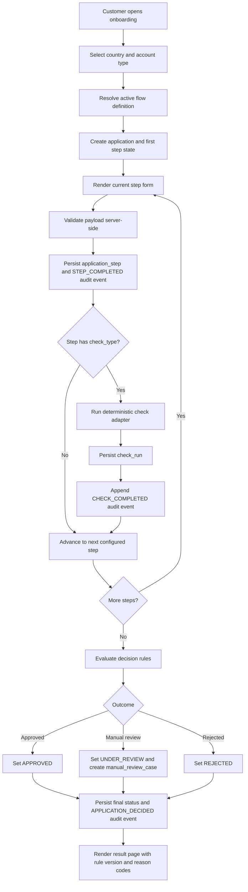

# Onboarding
Work sample app.

## Purpose

This project demonstrates a country-aware, customer-type-aware onboarding journey for:

- Sweden, Spain, and Poland
- Private individual and business applicants
- Deterministic mocked integrations and explainable final decisions

The design emphasizes adaptability, explicit state transitions, testability, and production-minded controls.

## Technology Stack

- Backend: FastAPI, Pydantic, SQLAlchemy, Alembic
- Database: PostgreSQL (Docker and CI), with in-memory repository support for tests
- Frontend: Server-rendered Jinja templates with small JavaScript enhancements
- Testing: pytest, Newman/Postman, Playwright
- Quality/Security: Ruff, mypy, Bandit, pip-audit, Gitleaks, Trivy

## Assignment Requirements Coverage

### 1) First Choice and Six Flows

The start screen captures country and account type, then resolves one of six flow variants.

| Country | Private flow | Business flow |
|---|---|---|
| Sweden | SE + PRIVATE | SE + BUSINESS |
| Spain | ES + PRIVATE | ES + BUSINESS |
| Poland | PL + PRIVATE | PL + BUSINESS |

### 2) Adaptive Journey, Validation, and Progress

- Step definitions are flow-driven (not hardcoded in route handlers).
- Step pages provide server-side validation and user feedback.
- Progress is shown per step and persisted in application_step records.
- Final review/result pages show explainable decision details.

### 3) Mock Integrations and Decision Outcomes

Mocked integration categories:

- KYC
- KYB
- SANCTIONS/PEP
- CREDIT/Affordability
- REGISTRY
- ADDRESS
- BANK

Each check is deterministic and supports:

- PASS
- MANUAL_REVIEW
- FAIL

Technical failure simulation is also supported:

- OK
- TIMEOUT
- ERROR

Final decision outcomes are deterministic and explainable:

- APPROVED
- UNDER_REVIEW
- REJECTED

### 4) Audit Trail and Decision Traceability

The app persists audit events and check runs including correlation IDs, reason codes, rule version, and explanation metadata so support and compliance review can reconstruct why a decision was made.

## Architecture (Mapped to Assignment Expectations)

1. Web layer
   - FastAPI routes and Jinja templates for start, step, result, and read APIs.
2. Flow engine
   - Country/type flow definitions and step ordering persisted in onboarding_flow and onboarding_step.
3. Application state
   - Application lifecycle, current step, completed steps, check runs, audit events, and review cases.
4. Integration layer
   - Deterministic check adapters behind ports to avoid brittle coupling to external clients.
5. Decisioning layer
   - Rule-based decision service mapping check outcomes to approved/manual review/rejected.
6. Audit layer
   - Structured event trail without storing sensitive data as raw logs.

Clean architecture boundaries:

- Presentation: routes, request/response mapping, templates
- Application: orchestration services and business rules
- Infrastructure: repositories, database models, unit of work
- Tests: focused on transitions, decisioning, mocks, and E2E paths

## Data Model Overview

Core persisted entities:

- onboarding_flow, onboarding_step: flow configuration and sequence
- application: selected flow and current lifecycle state
- application_step: per-step completion status and payload snapshot
- check_run: check type, business result, technical result fingerprint
- audit_event: event timeline and structured metadata
- manual_review_case: case opened for escalated outcomes

This schema supports resumability and supportability by making step progression and integration outcomes queryable over time.

## Onboarding Dataflow Diagram

## Tradeoffs and Scope Notes

- Private and business flows are implemented as seven-step journeys per market, with explicit address and bank verification boundaries.
- Mock integrations are deterministic by design (repeatable tests and demos) rather than probabilistic.
- Sensitive identity values are validated and processed, but audit metadata stores fingerprints/reason codes instead of raw PII dumps.

## CI and Security Policy

Security policy details, required checks, branch-protection expectations, and temporary exception workflow are documented in SECURITY.md.

Security-minded defaults included:

- Least-privilege workflow permissions
- Concurrency cancellation for superseded runs
- Enforced SAST, secrets, dependency, and container scan gates
- Security artifact upload with retention for triage and audits

## Quick Start (Local Python)

1. Create and activate a virtual environment.
2. Install Python dependencies:
    - `pip install -r requirements-dev.txt`
3. Install Node dependencies:
    - `npm install`
4. Build frontend styles:
    - `npm run build:css`
5. Copy environment file:
    - `cp .env.example .env` (Linux/macOS)
    - `copy .env.example .env` (Windows)
6. Ensure PostgreSQL is running and configured from `.env`.
7. Run database migrations:
    - `alembic upgrade head`
8. Start the app:
    - `uvicorn app.main:app --reload`

Default local URLs:

- App home: `http://127.0.0.1:8000/`
- Onboarding start page: `http://127.0.0.1:8000/onboarding`
- Swagger UI: `http://127.0.0.1:8000/docs`
- ReDoc: `http://127.0.0.1:8000/redoc`
- OpenAPI JSON: `http://127.0.0.1:8000/openapi.json`

## Docker Local Run

- Build and start stack: `npm run docker:up`
- Stop stack: `npm run docker:down`
- Follow app logs: `npm run docker:logs`

Default host ports are conflict-safe:

- Web app: `http://127.0.0.1:8001`
- PostgreSQL: `127.0.0.1:5433`

Docker URLs:

- App home: `http://127.0.0.1:8001/`
- Onboarding start page: `http://127.0.0.1:8001/onboarding`
- Swagger UI: `http://127.0.0.1:8001/docs`
- ReDoc: `http://127.0.0.1:8001/redoc`
- OpenAPI JSON: `http://127.0.0.1:8001/openapi.json`

Inside Docker network, the app connects to Postgres via `DB_HOST=db` and `DB_PORT=5432`.

## Useful API Endpoints

- `POST /api/onboarding/start` - create a new onboarding application
- `POST /api/onboarding/{application_id}/advance` - advance to next step with scenario (`PASS`, `MANUAL_REVIEW`, `FAIL`)
- `GET /api/onboarding/{application_id}` - read current application status
- `GET /api/onboarding/{application_id}/audit-events` - list audit trail events
- `GET /api/onboarding/{application_id}/check-runs` - list executed check runs
- `GET /api/onboarding/{application_id}/manual-review` - get manual review case if created

## Route Behavior

- Invalid UI routes render a custom 404 page.
- Invalid API routes return JSON with a `404` status and `{"detail": "Not Found"}`.

## Testing

- Lint: `ruff check .`
- Python tests: `pytest`
- Newman/Postman tests: `npm run test:api`
- Build Tailwind CSS: `npm run build:css`
- Tailwind watch mode: `npm run watch:css`
- Playwright tests (all browsers): `npm run test:e2e`
- Playwright test per browser:
	- `npm run test:e2e:chromium`
	- `npm run test:e2e:firefox`
	- `npm run test:e2e:webkit`

## CI

GitHub Actions workflow is defined in `.github/workflows/ci.yml` and runs:

1. Lint and type checks (`ruff`, `mypy`)
2. Security policy gates (`bandit`, `pip-audit`, `gitleaks`)
3. Python test suite (`pytest`)
4. API tests via Newman/Postman
5. Docker image build and Trivy container scan
6. Playwright E2E tests as a browser matrix (Chromium, Firefox, WebKit)

Security-minded defaults included:

- Least-privilege workflow permissions (`contents: read`)
- Concurrency control to cancel superseded runs
- Enforced branch-protection status checks for merge blocking
- Security artifact retention for investigation and auditability

## CD and AWS Hosting

Automated deployment is implemented with GitHub Actions in `.github/workflows/cd.yml`.

Production deployment flow:

1. Trigger on `main` pushes.
2. Build and tag Docker image from repository source.
3. Push image to Amazon ECR.
4. Generate `Dockerrun.aws.json` from `Dockerrun.aws.json.template`.
5. Deploy new application version to AWS Elastic Beanstalk.

AWS runtime architecture:

- Compute/runtime: Elastic Beanstalk Docker environment (`Onboarding-prod`)
- Container registry: Amazon ECR
- Database: Amazon RDS PostgreSQL
- Region: `eu-north-1`

Production URL:

- App: `http://13.62.117.128/`
- Onboarding: `http://13.62.117.128/onboarding`

Deployment notes:

- Container startup runs database migrations before application startup (`alembic upgrade head`).
- Environment variables for database and runtime configuration are managed in Elastic Beanstalk environment settings.
- CSS build assets are versioned in git for deployment consistency, including `app/presentation/web/static/dist/styles.css`.

For initial AWS setup and required repository/environment secrets, see `docs/aws-cd-setup.md`.
